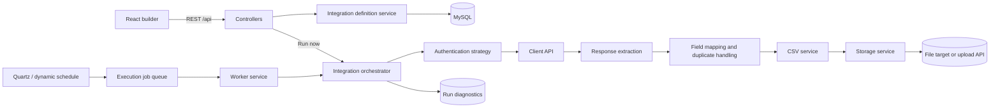
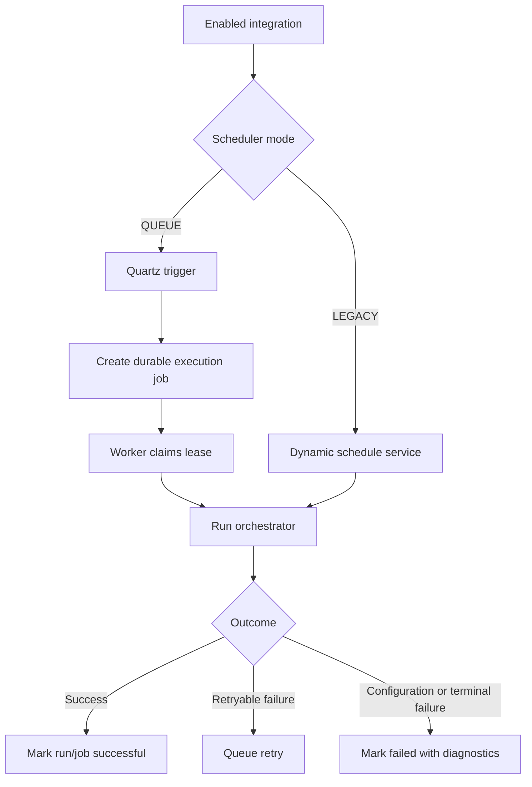

# Backend architecture

## Runtime flow

`IntegrationOrchestrator` is the central execution path. It records an `IntegrationRun`, applies authentication, executes enabled fetch steps, extracts the configured records, maps CSV columns, stores the generated artifact, and records either success or structured failure diagnostics.

## Definition model

An `IntegrationDefinition` stores configuration as JSON-backed sections plus field-mapping rows:

| Section | Responsibility |
| --- | --- |
| `authConfig` | Client API authentication: none, Basic, bearer, API key, OAuth client credentials, or token API. |
| `stepConfig` | Ordered HTTP requests, including headers, query parameters, request body, placeholders, request/response formats, and date-window behavior. |
| `responseConfig` | Record path and type (JSONPath/XPath), optional local date filtering, and duplicate rules. |
| `paginationConfig` | Page-number or next-link pagination. |
| `storageConfig` | Storage target and target-specific connection/upload configuration. |
| `scheduleConfig` | One or more daily, hourly, monthly, or custom schedule definitions. |
| `fieldMappings` | Source-to-CSV mapping, constants, expressions, formatters, defaults, and required columns. |

## Scheduling and execution modes

Use `QUEUE` for scalable deployments. Jobs are persisted, leased to workers, and retried according to their configured limits. Legacy mode remains available for direct in-process scheduling.

## Request placeholders and date windows

Placeholders can be used in a step URL, headers, query parameters, and body. The backend resolves them at run time, so each client can use its own date representation. For example, configure `windowStartDateFormat=yyyyMMdd` and use `${windowStartDate}` where the client expects it.

- `NONE`: one request for the run.
- `SINGLE_DATE`: one request for each date in the active window.
- `DATE_RANGE`: one request containing window start/end placeholders.

The result is then parsed as JSON, XML, or SOAP according to the configured response format. `requestFormat` must be `JSON`, `XML`, or `SOAP`; `JSON_PATH` is a path type, not a payload format.
