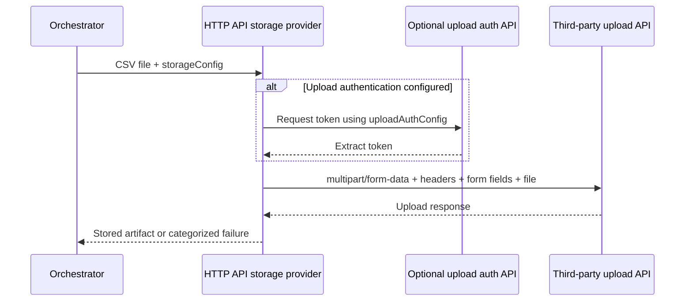
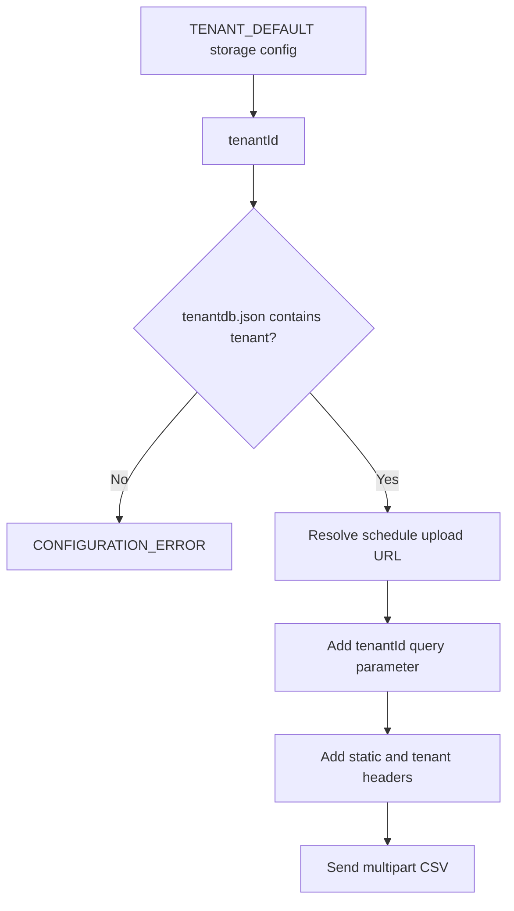

# Storage and file delivery

## Supported targets

| Type | Use when | Required configuration |
| --- | --- | --- |
| `LOCAL` | Local/server filesystem is the final destination. | Output directory. |
| `S3` | A compatible AWS S3 destination is required. | Bucket and S3 credentials/settings. |
| `FTP` | The server expects unencrypted FTP. | Host, port, username, password, remote directory; passive mode where required. |
| `FTPS` | The server uses **implicit TLS/SSL FTP**. | Host, port, username, password, remote directory, passive mode. |
| `SFTP` | The server uses SSH File Transfer Protocol. | Host, port, username and password or SSH key, remote directory. |
| `HTTP_API` | A third-party API accepts a multipart file upload. | Upload URL, HTTP headers/form fields, file parameter, and optional upload authentication. |
| `TENANT_DEFAULT` | Multiple tenants share an upload contract but use tenant-specific identifiers/tokens. | Tenant ID in the definition and an external tenant database. |

FTPS and SFTP are different protocols. The current FTPS provider uses **implicit FTPS**, which begins TLS at connection time. Do not choose SFTP for an FTPS/SSL WinSCP connection.

## HTTP API upload



`uploadAuthConfig` is independent from the fetch-step `authConfig`. Use it only when the receiving upload API has a separate authentication mechanism. It supports the same configured authentication strategies and merges generated headers/query parameters into the upload request.

## Tenant-default upload

`TENANT_DEFAULT` delegates to the HTTP API provider but takes its destination from server configuration. The selected schedule resolves the default URL template (daily/hourly/monthly). The tenant record supplies its credentials and optional overrides.



Example `config/tenantdb.json` (never commit real values):

```json
{
  "tenant-a": {
    "Register_Id": "replace-with-register-id",
    "accessToken": "replace-with-token"
  }
}
```

The file is ignored by Git and Docker build context. It is checked on each tenant lookup; replacing the file updates the next upload without restarting the application. `config/tenantdb.example.json` is the tracked template.

For the default Wovv-style contract, the provider sends `Event`, `channel`, and `isSourceFileMoved` headers, the configured tenant token/register identifier, `partyC_Code` from `brandCode`, and the generated CSV as a multipart file.

## TLS and secrets

- Keep passwords, API keys, access tokens, and tenant databases outside Git.
- FTPS server certificates are validated through the JVM trust store. Install the issuing/private CA when necessary; do not weaken certificate validation in code.
- A connection timeout usually indicates network reachability, port/firewall, protocol mismatch, or passive-data-port restrictions—not a CSV mapping problem.
